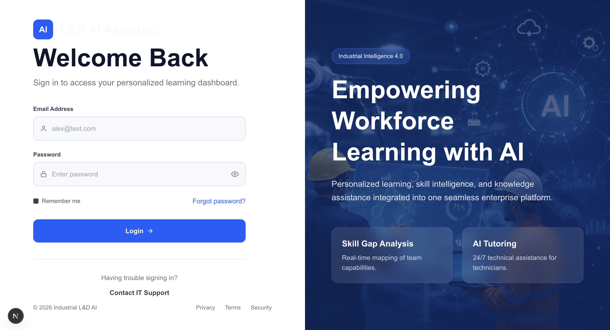
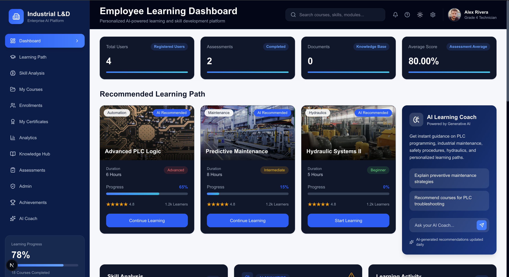
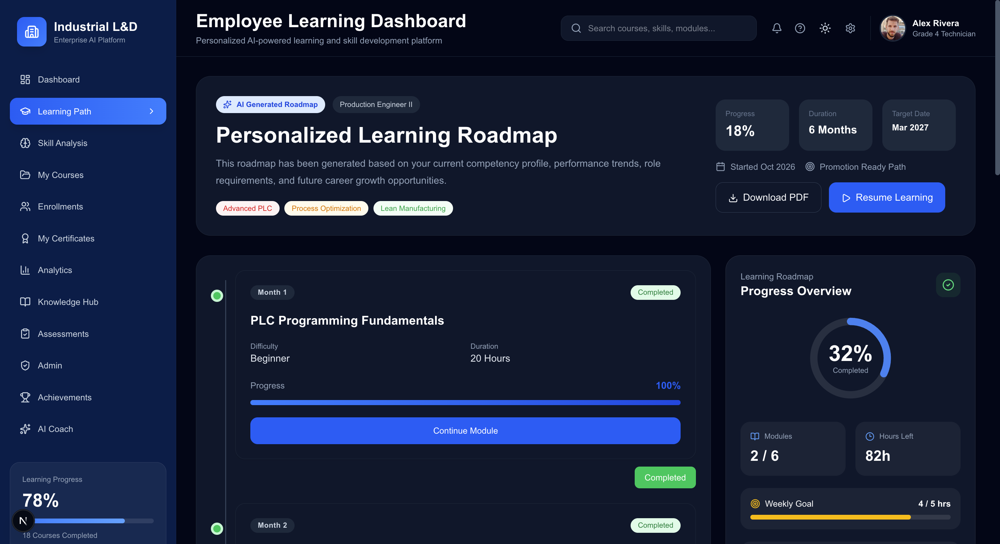
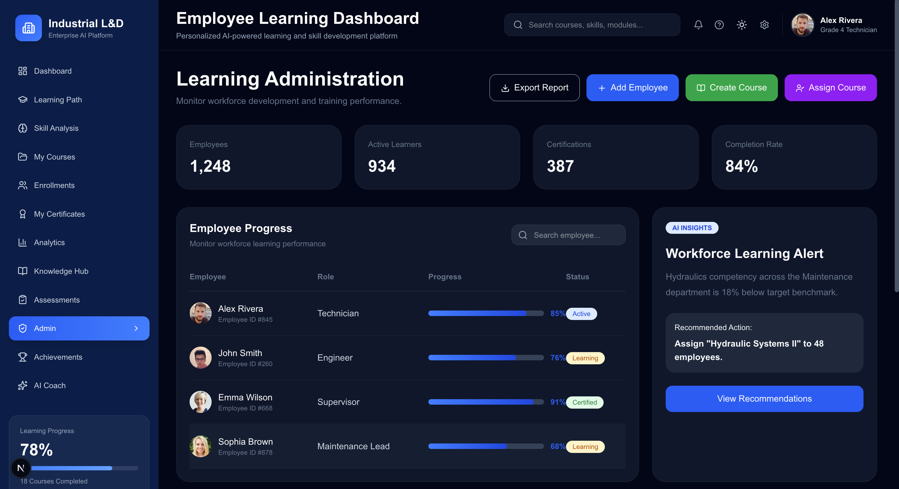
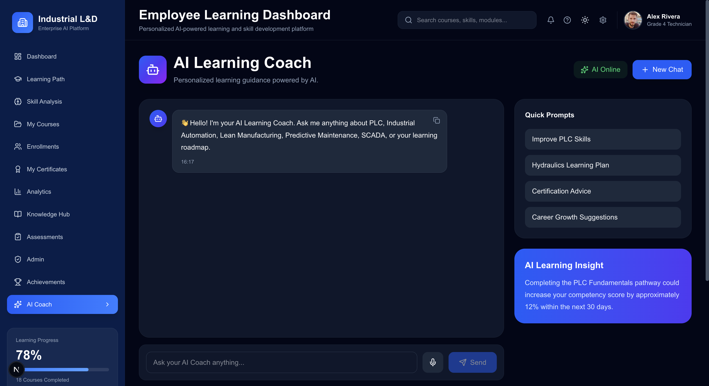

# 🤖 SmartLearn AI – Industrial Learning & Development Assistant

An AI-powered Learning & Development (L&D) platform designed for industrial organizations to enhance workforce training, bridge skill gaps, and provide personalized learning experiences using Generative AI.

---

## 📌 Project Overview

Traditional industrial training systems often suffer from:

- Lack of personalized learning
- Poor visibility into employee skill gaps
- Manual course management
- Limited access to technical knowledge
- Low training engagement
- Time-consuming certification processes

SmartLearn AI addresses these challenges by integrating Artificial Intelligence into the complete learning lifecycle.

---

# 🚀 Key Features

## 🔐 Authentication

- Secure Login
- JWT Authentication
- Role-Based Access
- Protected Routes

---

## 👨‍💼 Employee Management

- Add Employees
- View Employees
- Department Management
- Role Management

---

## 📚 Course Management

- Create Courses
- View Courses
- Course Details
- Course Status
- Enrollment Count

---

## 🎯 Enrollment System

- Enroll Employees into Courses
- Track Learning Progress
- View Enrolled Courses

---

## 🧠 AI Coach

Powered by Large Language Models to provide:

- Technical Assistance
- Learning Guidance
- Industrial Knowledge Support
- Personalized Responses

---

## 📖 Knowledge Hub

- Centralized Learning Resources
- AI-assisted Knowledge Retrieval
- Context-aware Responses (RAG)

---

## 🛣 Personalized Learning Roadmap

- AI Recommended Learning Paths
- Skill Development Timeline
- Progress Tracking

---

## 📈 Analytics Dashboard

- Employee Statistics
- Learning Progress
- Department Analytics
- Skill Gap Visualization
- Training Insights

---

## 🏆 Certificate Generation

- Professional Certificate Design
- Auto-generated Certificate ID
- Download as PDF
- Enterprise Style Certificate

---

## 📊 Business Benefits

- Reduced Training Time
- Personalized Learning
- Better Employee Engagement
- Improved Skill Visibility
- Automated Administration
- Faster Knowledge Access

---

# 🏗 System Architecture

```
                    Employee / Admin

                           │

                           ▼

                Next.js Frontend (React)

                           │

                           ▼

                  Express.js REST API

                           │

          ┌─────────────────────────┐
          │ JWT Authentication      │
          └─────────────────────────┘

                           │

                 MongoDB Database

                           │

          ┌─────────────────────────┐
          │                         │
          │ Users                   │ 
          │ Courses                 │
          │ Enrollments             │
          │ Certificates            │
          │                         │
          └─────────────────────────┘

                           │

                 AI Knowledge Layer

                           │

                 Retrieval-Augmented
                    Generation (RAG)

                           │

                           ▼

                 Groq LLM (Llama Model)

                           │

                           ▼

               AI Coach & Recommendations
```

---

# 🛠 Tech Stack

## Frontend

- Next.js
- React
- TypeScript
- Tailwind CSS
- Axios
- Lucide Icons

---

## Backend

- Node.js
- Express.js
- MongoDB
- Mongoose
- JWT Authentication
- bcrypt.js

---

## AI

- Groq API
- Llama Model
- Retrieval-Augmented Generation (RAG)

---

## Other Libraries

- html2canvas
- jsPDF

---

# 📂 Project Structure

```
SmartLearn-AI
│
├── frontend
│   ├── src
│   │   ├── app
│   │   ├── components
│   │   ├── services
│   │   ├── utils
│   │   └── styles
│
├── backend
│   ├── src
│   │   ├── controllers
│   │   ├── models
│   │   ├── routes
│   │   ├── middleware
│   │   ├── services
│   │   └── config
│
└── README.md
```
---

# 📸 Application Screenshots

## 🔐 Login Page



---

## 📊 Employee Dashboard



---

## 🎯 Personalized Learning Path



---

## 👨‍💼 Admin Dashboard



---

## 🤖 AI Coach



---
---

# ⚙ Installation

## Clone Repository

```bash
git clone https://github.com/yourusername/SmartLearn-AI.git
```

---

## Backend

```bash
cd backend
npm install
npm run dev
```

---

## Frontend

```bash
cd frontend
npm install
npm run dev
```

---

# 🔑 Environment Variables

Backend `.env`

```env
PORT=8000

MONGO_URI=YOUR_MONGODB_URI

JWT_SECRET=YOUR_SECRET_KEY

GROQ_API_KEY=YOUR_GROQ_API_KEY
```

---

# 📷 Application Modules

- Login & Authentication
- Employee Dashboard
- Admin Dashboard
- Employee Management
- Course Management
- Learning Roadmap
- AI Coach
- Knowledge Hub
- Analytics Dashboard
- Certificate Generation
- Course Enrollment

---

# 🎯 Business Impact

### Before SmartLearn AI

- Manual employee training
- Low learning engagement
- Static learning content
- Knowledge silos
- Slow onboarding
- No personalization

---

### After SmartLearn AI

- AI-powered personalized learning
- Automated recommendations
- Interactive AI Coach
- Centralized knowledge
- Professional certification
- Data-driven analytics

---

# 📈 Expected Outcomes

- ⬇️ 30% Reduction in Training Time
- ⬇️ 55% Reduction in Manual Administrative Work
- ⬆️ 45% Increase in Course Completion
- ⬆️ 60% Better Learning Engagement
- ⬆️ Faster Employee Onboarding
- ⬆️ Improved Skill Development

---

# 🔮 Future Scope

- Voice-enabled AI Coach
- Mobile Application
- SAP Integration
- HRMS Integration
- Predictive Skill Analytics
- Career Recommendation Engine
- Real-time Learning Analytics
- AI-powered Assessment Generation
- Multilingual AI Assistant
- Digital Badge & Blockchain Certificates

---

# 👨‍💻 Author

**Rishu Kumar**

B.Tech Student  
BIT Sindri

---

# 📜 License

This project is developed for educational and internship purposes.

---

# ⭐ Acknowledgements

- Next.js
- React
- Node.js
- Express.js
- MongoDB
- Tailwind CSS
- Groq AI
- Llama Models
- Open Source Community

---

## ⭐ If you found this project helpful, don't forget to star the repository!
